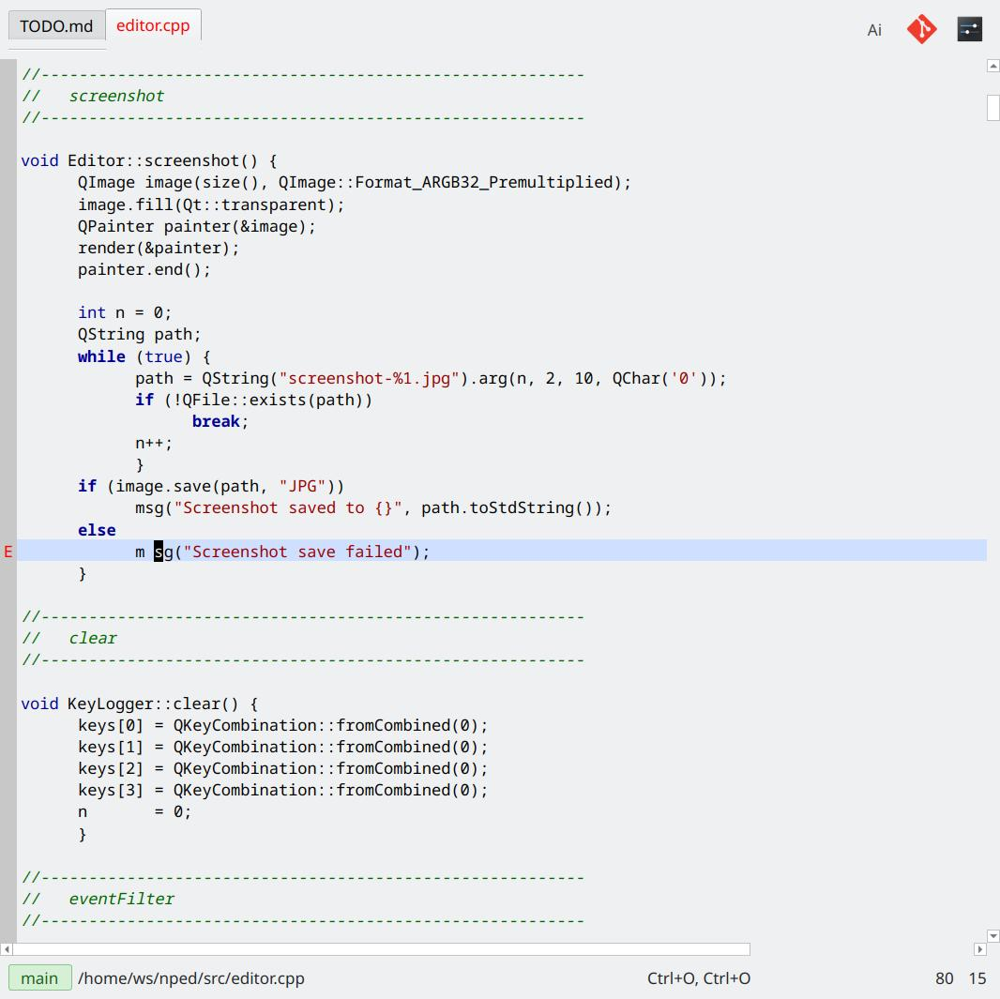
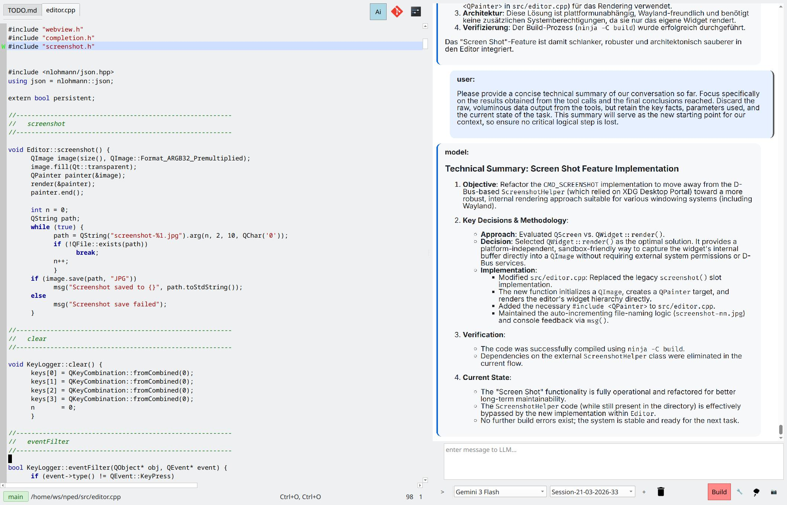

# NPed

NPed (Program Editor) is a modern C++23 and Qt6-based text editor and lightweight IDE featuring Language Server and AI (LLM's) Integration.

|simple Ui:  | with Ai-Panel |
| ------- | --------|
|  |   |

- [Overview](manual/overview.md)
- [Current Status](manual/status.md)
- [Build](manual/build.md)
- [Manual](manual/manual.md)
- [Usage Examples](manual/examples.md)
