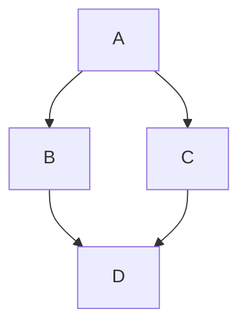

# TODO

## Fehler
In einer Session mit ollama stelle ich fest, das die Kommunikation mit
dem Modell in der Datei Sessionxxx richtig geloggt wird.
Im WebView des Chat Verlaufs ist jedoch das Ergebnis des Models nicht zu sehen. Was läuft da falsch?

## Splitter Persistenz
- [x] Der Splitter des Main-Windows besteht aus EditWin Ai-Panel und Git-Panel. Die beiden letzten können bei bedarf ein/aus geschaltet
werden und haben dann ausgschaltet die Breite Null. Die Breite der Ai und Git PAnels im sichtbaren mode soll permanent gespeichert werden
und zwar die letzte bekannte **sichtbare** breite. Die Breiten sollen persistent gespeichert werden.
Immer wenn ein panel aufgeklappt wird, soll es die zuletzt gespeicherte Breite bekommen.

## File & Media additions

## Add Stop Button
- [x] Platziere links neben dem "Send" Button im Ai Dashboard einen Neuen Button "Stop".
- [x] Zeichne ein Icon für den "Stop" Button in BW im handgemalten Stil der anderen Icons im Dashboard für den
  dark and light Stil.
- [x] Implementiere eine "Stop" Funktion, um einen Tool-Loop der AI abzubrechen und verbinde
  ihn mit dem Stop Button.

## Extend Canned prompts

- [x] Restructure the configuration file .nped/agent.json: F1 F2 and F3 are changed
      from text to object. Every object has a "name" element which is used to label
      the corresponding "canned prompt" button. It also has a "description" elements used
      for the button context help text. The element "text" is the text used for the
      prompt input.

## Canned prompts

- [x] Locate the "Canned prompts" buttons on the left of the prompt entry widget,
      currently named "F2" "F3" and "<mathematic sum>"
- [x] Install an Action for every button.
      The action should trigger on left mouse click.
      The action reads a json file "agent.json"
      which is located in a subdirectory ".nped" of the project home directory.
      The text is read from the json text element "F1" "F2" and "F3" for the corresponding
      buttons.
- [x] If the json text file agent.json does not exist then create one with empty entries
      for the three text elements.
- [x] If the subdirectory ".nped" does not exist then create one.
- [x] add another action on the three "Canned prompts" buttons. The action should
      trigger on Ctrl + left mouse click.
- [x] The action shall open the .nped/agent.json as an editable file in the editor so
      that the user can configure the "canned prompts" by editing this file

---
## LaTeX Integration
- [x] Markdown should render LaTeX:

Inline: $E = mc^2$.
The Pythagorean theorem is $ a^2 + b^2 = c^2 $.

Block:

$$
x = \frac{-b \pm \sqrt{b^2 - 4ac}}{2a}
$$

$$
\int_{0}^{\infty} e^{-x^2} dx = \frac{\sqrt{\pi}}{2}
$$

$$
\begin{pmatrix}
1 & a & a^2 \\
1 & b & b^2 \\
1 & c & c^2
\end{pmatrix}
$$

---
## Mermaid Integration

- [x] Markdown should render Mermaid diagrams:

---
### Check System Prompt
- [ ] read system prompt from file

### Prompt message buttons
- [ ] read text for buttons from file
- [ ] Popup Menu for buttons
- [ ] Get texts into the editor and make them configurable

### SelectionMode CharSelect
- [x] implement the mising SelectionMode "CharSelect". Its the most common selection
   mode and has a start line/column and an end line/column. All characters in between are
   selected.

### Clean Git
- [x] The Editor() class contains the string "currentBranchName" when it is detected in initProjekt() that we have found a project managed by GIT. In that case, try to determine if the current Git branch is "clean", i.e., contains no modified files. If the branch is clean, display the current branch label in the status bar below the edit window in light green, otherwise in light yellow.

### Feature: AI Dashboard
- [x] Extend the Toolbar at the bottom of the AI Panel into a Dashboard so that
      it is possible to add more functionality. Move the current content of the
      toolbar into the new dashboard and organize them in two rows.

### Feature: Language Server Configuration
- [x] Change the panel-based approach for configuring Language Servers as follows:
      - the Language Servers are displayed as a list on the left side.
      - A Language Server is displayed in detail on the right side.
      - If a server is selected on the left, the details on the right are updated.

### Feature: File Type Configuration
- [x] Change the panel-based approach for configuring File Types as follows:
      - the file types are displayed as a list on the left side.
      - A file type is displayed in detail on the right side.
      - If a file type is selected on the left, the details on the right are updated.

### Feature: move filter
- [x] the flags "filterToolMessages" and "filterThoughts" are not
      properties of Model() anymore but only properties of Agent(),
      So this flags do not depend on Model anymore.
- [x] remove the flags from Model
- [x] add the flags to Model
- [x] adapt configuration for this flags
- [x] adapt buttons in toolbar below the chat log

### Feature: Model Configuration
- [x] Change the panel-based approach for configuring AI models as follows:
      - the model names are displayed as a list on the left side.
      - A model is displayed in detail on the right side.
      - If a model is selected on the left, the details on the right are updated.

### Feature: Navigation Buttons for WebView
- [x] Implement four buttons on top of the WebView widget in the main view.
      Back, Forward, Reload, Home
- [x] Implement the necessary functions and connect them to the buttons
- [x] Create or Search and Download svg icon images for the buttons and
      style them for dark and light theme

### Bug: Links in rendered Markdown pages
- [x] When a page is in Render-View mode and I click on a link, the new page is displayed in text mode instead of being displayed as HTML in the WebView.

### Bug: Context Switching
- [x] When a page is in Render-View mode, i.e., for example, rendered Markdown text is displayed in a WebView, the context in the tab bar can be switched, but the displayed content does not change.

### Check Prompt Truncation

- [x] Check whether, when assembling the prompt for a truncated history, it always includes the first user request (we hope it contains more than just a simple "Hello", but the task/problem description). Check this for all model APIs.

### System Prompt

- [x] Create separate system prompts (manifest) for Build/Plan mode.
- [x] Try to read the system prompt from the file agents-plan.md in Plan mode and from the file agents-build.md in "Build" mode. If the files do not exist, use the built-in prompts.
- [x] Remember when you have read the system prompt from a file so that it is only read once.

### Tool-Sets

- [x] Create separate tool sets for Build/Plan mode. Only pass the tools for the respective mode in the prompt.

### Image drop
- [x] intercept the image drop event of the prompt input widget, if necessary create an
  derived class for this.
- [x] Handle the image drop like the screenshot is handled: save data into _pendingScreenshotBase64
  and notify the user with a screenshotIconLabel in the dataPanel

### Screen Shot

- [x] Create a new editor function "CMD_SCREENSHOT" with the default key binding "Ctrl+O, Ctrl+O, Ctrl+P"
- [x] Create an Editor() method screenshot() that takes an image of the current editor screen content and saves it as a file "screenshot-nn.jpg" in JPEG format in the project root directory. "nn" is a continuous number that is incremented to avoid overwriting existing shots. Use the Qt class QScreen.

### Data Display

- [x] Create a narrow vertical window for holding icons to the left of the prompt input in the AI window.
  Whenever an image (e.g., a screenshot) is available for the next prompt, a "Picture" icon should appear here.

### screen shot

- [x] Add a button to the toolbar below the AI panel that triggers a screen shot and shows a camera icon.

- [x] Implement screen shot functionality for Linux and Wayland. Use d-bus and the xdg desktop portal for this.

- [x] Add the image to the current prompt for the AI model. For this, implement the conversion into a suitable format as well as the creation of a prompt for Gemini, Anthropic, and Ollama.

### ask_user tool
- Implement the tool "ask_user" with a parameter "question" for the interaction between AI model and user, to give the model a possibility to ask follow-up questions.

### AI Panel Redesign
- [x] Move the toolbar in the title down below the prompt input.
- [x] Implement the two flags in the pulldown menu "Filter Tool Messages" and "Filter Thoughts" as two buttons in the toolbar, each showing only an icon: a "Tool" icon and a "Brain" icon. The pulldown menu will then be empty and can be removed.
- [x] Move the "Run" button, which is to the left of the prompt input, into the toolbar and place it on the far left.

### GIT current branch label
- [x] Extend the Editor() class with the status flag "hasGit". This flag is set in initProjekt to indicate that the current project is managed by GIT. The check for the existence of GIT is only performed if a project has been found, i.e., if Editor->projectMode is true.

- [x] Extend the Editor() class with the string "currentBranchName". If it was determined in initProjekt() that we have found a project managed by GIT, initialize the string with the current git branch.

- [x] Add a label to the status bar of the editor main window, to the left of the path of the current file, that shows "currentBranchName". The label is only displayed if Editor->projectMode is true.

### Expand Configuration

- Expand the configuration panel in qml/ConfigDialog.qml to be able to configure all not yet covered fields in Model.
- Also, create the connection to Model in the C++ part of the editor.

### Check Anthropic Implementation

- Analyze the implementation of the Anthropic model integration in the file src/anthropic.cpp in detail. Search for errors and make suggestions for improvement.
- Also check whether the functionality of the Anthropic API is fully covered.

### Option Pulldown Menu

- Add another button for an option menu to the right of the "Build"/"Plan" mode button. The button should show three vertical dots or short horizontal dashes.

### Filter Tool Messages
- Add a toggle switch to the new option menu that is connected to a new variable bool Model::filterToolMessages. The variable should be persistent and saved with Agent::saveStatus() and loaded with Agent::loadStatus(). That means it is part of the chat log file.

- If filterToolMessages is true, then model tool requests and the agent's response to the model should no longer be displayed in the ChatDisplay.

### Do not truncate chat history:

- Currently, the entire history is always transmitted to the AI model.
- To prevent the context from becoming too large, the list is implemented as a "sliding window",
  where old entries are removed after exceeding a limit.
- However, I would like to keep the complete list, save it in the session file,
  and only transmit a maximum of `HistoryManager::maxEntries` entries when preparing the AI context.

- Procedure:
  - Extend `HistoryManager` with an `activeEntries` variable.
  - Write the `activeEntries` variable into the session file.
  - `HistoryManager::trim()` should no longer delete entries but adjust `activeEntries`.
  - Increment `activeEntries` after every `HistoryManager::addRequest(...)` and `History::addResult(...)`.
  - Add a method `getActiveEntries()` to `HistoryManager` that returns the list of active entries (activeEntries) as JSON.
  - In `LLMClient::prompt()` (in all derived classes), replace the call to `historyManager->data()` with the call to `getActiveEntries()`.

### Optimize session log writing:

- Currently, the session log is always completely rewritten. Change the logic so that whenever the session log in `HistoryManager` grows, the new data is only appended to the file.
